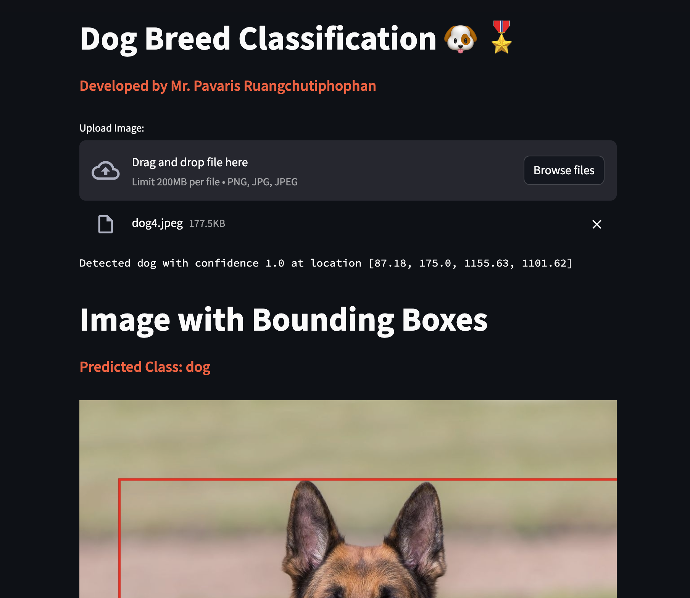

# Dog Breed Classification
- Plan : utilizing DETR + ViG architecture with added CNN + classifier,
- Detector : DETR
- Classifier : ViG-CNN
- an implementation details will be updated soon

# Web Application Demo
For Demo Web Application, You can enter it via 
[dog-breed-classification website](https://oppai-dog-breed-classification.streamlit.app/)



To run script in order to Open Web Application Dashboard
```
git clone https://github.com/pavaris-pm/dog-breed-classification.git
pip install requirements.txt
streamlit run src/production/dashboard.py
```
