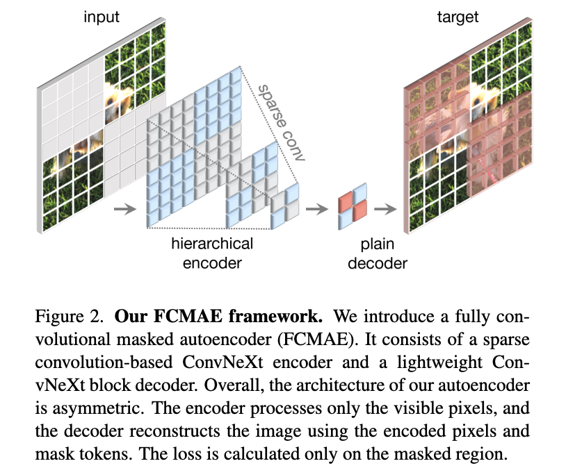
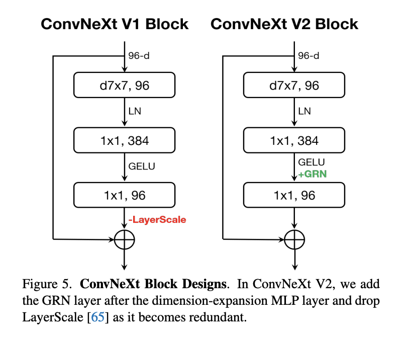
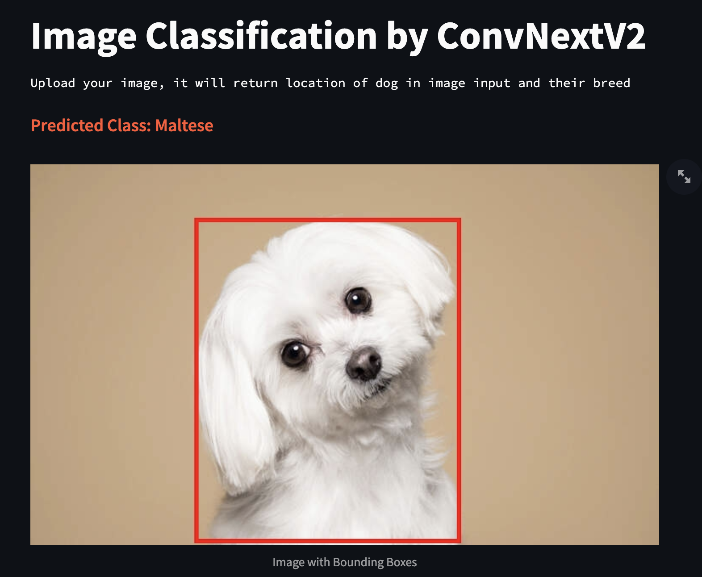
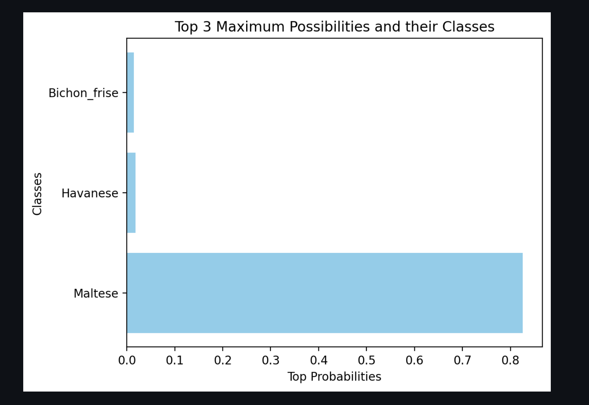

# Dog Breed Classification 🐶 🥇
- `Detector` : DetiontionTransformer (DETR)
- `Classifier` : ConvNextV2 / ConvolutionalAutoEncoder (full-architecture)

## `ConvNextV2` Proposed Component
- `FCMAE` : Fully-Connected Masked Autoencoder
-  `GRN` : Global Response Normalization
  
<p align='center'>

	

</p>

## Web Application Demo
For Demo Web Application, You can enter it via 
[main dog-breed-classification webapp](https://oppai-dog-breed-classification-webapp-for-deployment.streamlit.app/) or [dog-breed-classification sub](https://oppai-dog-breed-classification.streamlit.app/) in case that the first url is crash

<p align='center'>


</p>


## Contributors
<a href="https://github.com/pavaris-pm/dog-breed-classification-webapp/graphs/contributors">
  
</a>


## Citations

If you use `ConvNextV2-Large-DogBreed` in your project or publication, please cite the model as follows

```
Pavaris Ruangchutiphophan. ConvNextV2-large-DogBreed (Revision 3ddd523). Huggingface, 2023, http://doi.org/10.57967/hf/1288 
```

or BibTeX entry:

```bib
@misc {pavaris_ruangchutiphophan_2023,
	author       = { {Pavaris Ruangchutiphophan} },
	title        = { ConvNextV2-large-DogBreed (Revision 3ddd523) },
	year         = 2023,
	url          = { https://huggingface.co/Pavarissy/ConvNextV2-large-DogBreed },
	doi          = { 10.57967/hf/1288 },
	publisher    = { Hugging Face }
}
```
